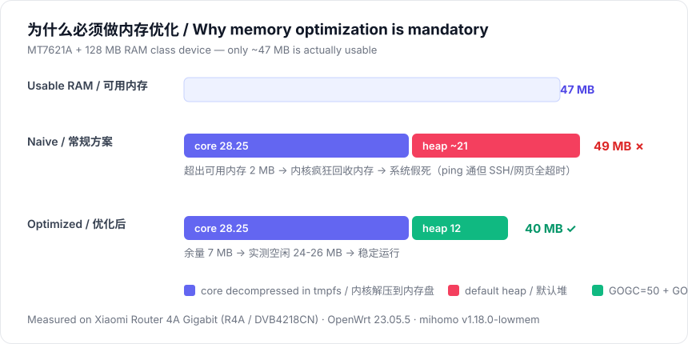
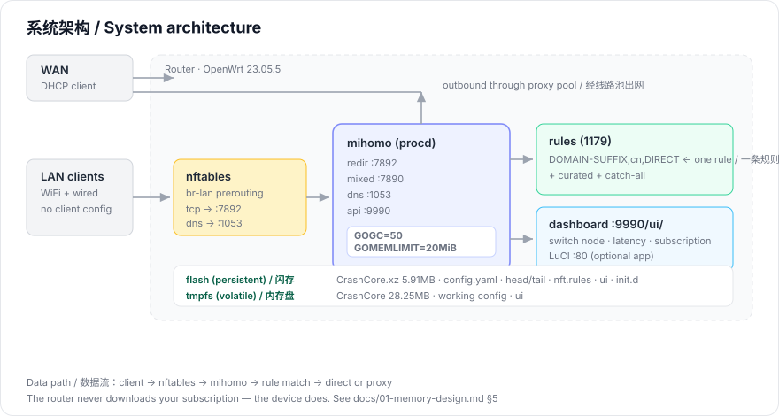
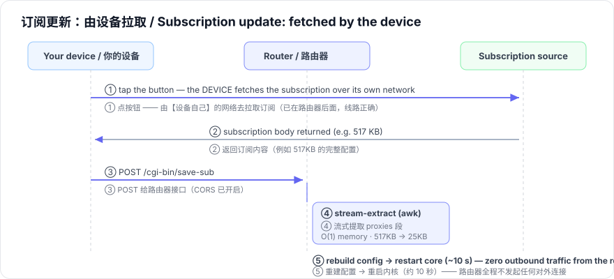

# mihomo-lowmem

**Memory-optimized transparent proxy gateway for resource-constrained OpenWrt routers.**
**面向内存受限 OpenWrt 路由器的精简透明代理网关。**

[](LICENSE)
[](https://openwrt.org)
[](https://github.com/MetaCubeX/mihomo)
[](#-the-core-problem--核心问题)

---

## English

### What is this?

A complete, production-ready deployment of [mihomo](https://github.com/MetaCubeX/mihomo)
(Clash.Meta) on routers that were **never meant to run it**.

The target device class: **MT7621A + 128 MB RAM** (e.g. Xiaomi Router 4A Gigabit,
and dozens of similar models). On such a device only **~47 MB** of RAM is actually
usable. A naive mihomo deployment needs **~49 MB** — it does not merely run slowly,
it **exhausts memory and freezes the whole system**.

This project is the result of solving that problem properly: every subsystem is
redesigned around the memory budget, not around features.

**Result:** a router that boots unattended, serves a transparent proxy to every
device on the LAN, survives power loss, and keeps **24–26 MB** of RAM free.

### The core problem

```
Available RAM ..................................... 47 MB
mihomo core decompressed into RAM ................. 28.25 MB
mihomo runtime heap (default) ..................... ~21 MB
                                                    ────────
Total required .................................... 49 MB   > 47 MB  ✗

→ memory exhaustion → kernel thrashes → userspace starves
→ you can still ping it, but SSH and the web UI time out
```



The same arithmetic after this project's optimizations:

```
Available RAM ..................................... 47 MB
mihomo core decompressed into RAM ................. 28.25 MB
mihomo runtime heap (GOGC=50, GOMEMLIMIT=20MiB) ... ~12 MB
                                                    ────────
Total required .................................... 40 MB   < 47 MB  ✓

→ 7 MB headroom → measured 24-26 MB free at runtime
```

### Architecture at a glance / 架构一览



### Highlights

| # | Highlight | Why it matters |
|---|---|---|
| 1 | **Fully autonomous boot** | Core lives compressed on flash; decompressed to RAM at boot. Power-cycle → back online in ~60 s, no PC involved. |
| 2 | **Memory-budget engineering** | `GOGC=50` + `GOMEMLIMIT=20MiB` cut the heap from 21 MB to ~12 MB. |
| 3 | **Small-dictionary compression** | `xz -9`'s 64 MiB dictionary needs 64 MB to decompress → instant freeze. A 2 MiB dictionary needs 2–4 MB. |
| 4 | **Self-compiled slim core** | `with_low_memory` build tag, no gvisor, stripped symbols: 30+ MB → 28.25 MB. |
| 5 | **TLD-driven rule economy** | One `DOMAIN-SUFFIX,cn,DIRECT` rule replaces tens of thousands of hand-written domain rules: 8450 → 1179 rules (−86 %). |
| 6 | **Device-side subscription update** | The router **never downloads the subscription**. The device you tap the button on does the download; the router only receives and applies. |



| 7 | **Streaming config processing** | `awk` extracts only what is needed, so peak memory is O(1) regardless of subscription size (517 KB → 25 KB measured). |
| 8 | **procd supervision** | Standard OpenWrt service manager: crash → auto-respawn, boot → auto-start, no session dependency. |
| 9 | **LuCI integration** | A native LuCI app (`admin/services/mihomo-lowmem`) with node switching, device-side subscription update and log viewer — no extra daemon, no extra RAM. |

### Documentation

| Document | 文档 |
|---|---|
| [Memory design ★](docs/01-memory-design.md) | [内存优化设计 ★](docs/01-memory-design.md) |
| [Architecture](docs/02-architecture.md) | [架构说明](docs/02-architecture.md) |
| [Installation ★](docs/03-installation.md) | [安装步骤 ★](docs/03-installation.md) |
| [Troubleshooting](docs/04-troubleshooting.md) | [故障排查](docs/04-troubleshooting.md) |
| [FAQ](docs/05-faq.md) | [常见问题](docs/05-faq.md) |
| [Contributing / upstream](docs/06-contributing.md) | [参与贡献 / 提交上游](docs/06-contributing.md) |
| [Publishing guide](docs/07-publishing.md) | [发布指南](docs/07-publishing.md) |
| [Launch post (ready to publish)](docs/08-launch-post.md) | [发布短文（可直接发布）](docs/08-launch-post.md) |
| [Visual guide / screenshots](docs/images/README.md) | [图示说明 / 截图规范](docs/images/README.md) |

### Tested hardware / 实测硬件

This project was developed and validated on one specific device. **Full model
information is listed so you can find the exact target/profile for your own router.**

| Field | Value |
|---|---|
| Brand | Xiaomi (小米) |
| Model (CN) | 小米路由器 4A 千兆版 |
| Model (EN) | Mi Router 4A Gigabit Edition |
| Model code | **R4A** |
| SKU | **DVB4218CN** |
| Region | China (CN) |
| OpenWrt target | `ramips/mt7621` |
| OpenWrt profile | `xiaomi_r4a` |
| Image name | `openwrt-23.05.5-ramips-mt7621-xiaomi_r4a-squashfs-sysupgrade.bin` |
| SoC | MediaTek **MT7621A** (MIPS 1004Kc, dual-core 880 MHz) |
| Flash | **Winbond W25Q128BV** — 16 MB SPI NOR |
| RAM | 128 MB DDR3 (measured usable: 120,480 KB) |
| Ethernet | 1× WAN + 2× LAN, Gigabit |
| Tested OS | OpenWrt 23.05.5 (r24106-10cc5fcd00) |

**Stock partition layout (mtd)** — needed for backups and flashing:

```
mtd0  ALL          16 MB      mtd1  Bootloader   mtd2  Config
mtd3  Bdata                   mtd4  Factory ★    mtd5  crash
mtd6  cfg_bak                 mtd7  overlay  1 MB
mtd8  OS1         ~13 MB      mtd9  rootfs       mtd10 disk  1.5 MB
```

> ★ `mtd4` holds radio calibration data — back it up before writing anything.

**Similar devices / 同类机型**

Any router in the same class (MT7621A, ≥128 MB RAM, ≥16 MB flash, nftables-capable
OpenWrt) should work with the same recipe after changing:

1. the OpenWrt target/profile in the image name,
2. the `GOARCH`/`GOMIPS` in `build/build-mihomo.sh`,
3. the `mtd` partition names in the flashing command.

> 同类机型（MT7621A、≥128MB 内存、≥16MB 闪存、支持 nftables 的 OpenWrt）
> 都可以套用同一套流程，只需改动三处：镜像名里的 target/profile、
> 编译脚本里的 `GOARCH`/`GOMIPS`、以及刷写命令里的 `mtd` 分区名。

### Compatibility

| Item | Value |
|---|---|
| OpenWrt | 21.02 / 22.03 / 23.05 (nftables required) |
| Architecture | `mipsel_24kc` (MT7621A, MT7620, …) — other arches by recompiling |
| Firewall | nftables (`fw4`) — **not** iptables |
| Minimum free RAM | ~40 MB (47 MB recommended) |
| Tested on | Xiaomi Router 4A Gigabit (R4A), OpenWrt 23.05.5, 16 MB flash |

### Quick start

```sh
# 1. Build the core on a Linux/macOS machine / 在电脑上编译内核
cd build && ./build-mihomo.sh

# 2. Deploy (see docs/03-installation.md for the full ordered procedure)
#    部署（完整步骤与顺序见 docs/03-installation.md）
scp mihomo-new   root@192.168.1.1:/overlay/mihomo/CrashCore.xz   # actually CrashCore.xz
scp files/*      root@192.168.1.1:/overlay/mihomo/

# 3. Enable / 启用
ssh root@192.168.1.1 '/etc/init.d/mihomo enable && /etc/init.d/mihomo start'
```

**Order matters.** The installation guide walks through 9 ordered stages; skipping
steps (especially the memory guards) will brick the running system.
**顺序很重要。** 安装指南分 9 个有序阶段；跳步（尤其是内存保护参数）会导致系统卡死。

### Safety & privacy

- No telemetry, no analytics, no external services.
- The dashboard and API bind to the LAN only.
- **This repository contains no credentials, no subscription URLs, no node names
  and no device identifiers.** All sensitive values are placeholders.

### License

[MIT](LICENSE) — the deployment glue in this repo is MIT.
`mihomo` itself is [GPL-3.0](https://github.com/MetaCubeX/mihomo/blob/Alpha/LICENSE).

---

## 中文

### 这是什么

一套完整、可直接投产的 [mihomo](https://github.com/MetaCubeX/mihomo)（Clash.Meta）
部署方案，专门针对**本来不适合跑它的路由器**。

目标设备类型：**MT7621A + 128MB 内存**（例如小米路由器 4A 千兆版，以及几十款同类机型）。
这类设备实际可用内存只有约 **47MB**。常规 mihomo 部署需要约 **49MB** ——
它不是"跑得慢"，而是**内存耗尽后整个系统假死**。

本项目就是把这个问题真正解决之后的成果：每个子系统都围绕内存预算重新设计，
而不是围绕功能堆砌。

**最终效果**：路由器开机自动就绪、为局域网所有设备提供透明代理、
断电重启后自动恢复，并且**保持 24–26MB 空闲内存**。

### 核心问题

```
可用内存 ........................................... 47 MB
mihomo 内核解压到内存 .............................. 28.25 MB
mihomo 运行时堆（默认参数） ........................ ~21 MB
                                                     ────────
合计需求 ........................................... 49 MB   > 47 MB  ✗

→ 内存耗尽 → 内核疯狂回收 → 用户态被饿死
→ ping 还通，但 SSH 和网页管理全部超时
```


本项目优化之后的同一笔账：

```
可用内存 ........................................... 47 MB
mihomo 内核解压到内存 .............................. 28.25 MB
运行时堆（GOGC=50, GOMEMLIMIT=20MiB） .............. ~12 MB
                                                     ────────
合计需求 ........................................... 40 MB   < 47 MB  ✓

→ 余量 7MB → 实测运行时空闲 24-26MB
```

### 架构一览


### 亮点

| # | 亮点 | 为什么重要 |
|---|---|---|
| 1 | **完全自主启动** | 内核以压缩包存于闪存，开机解压到内存。断电重启 → 约 60 秒自动恢复，全程不需要电脑。 |
| 2 | **内存预算工程** | `GOGC=50` + `GOMEMLIMIT=20MiB` 把堆从 21MB 压到约 12MB。 |
| 3 | **小字典压缩** | `xz -9` 的 64MiB 字典解压需要 64MB 内存 → 瞬间卡死；改用 2MiB 字典只需 2–4MB。 |
| 4 | **自编译精简内核** | `with_low_memory` 编译标签 + 去掉 gvisor + 去符号：30+MB → 28.25MB。 |
| 5 | **顶级域规则经济学** | 一条 `DOMAIN-SUFFIX,cn,DIRECT` 替代成千上万条手写域名规则：8450 → 1179 条（减少 86%）。 |
| 6 | **设备端更新订阅** | 路由器**从不下载订阅**。你点击按钮的那台设备负责下载，路由器只做接收和应用。 |
| 7 | **流式配置处理** | 用 `awk` 只提取需要的部分，内存占用恒定为 O(1)，与订阅大小无关（实测 517KB → 25KB）。 |
| 8 | **procd 标准守护** | OpenWrt 官方服务管理：崩溃自动拉起、开机自启、不依赖登录会话。 |
| 9 | **LuCI 原生集成** | 原生 LuCI 应用（`admin/services/mihomo-lowmem`）：线路切换、设备端更新订阅、日志查看 —— 无额外守护进程、不占额外内存。 |

### 文档索引

见上方 English 部分的表格（中英文指向同一份文件）。
See the table in the English section above (both languages point to the same files).

### 实测硬件

本项目的开发与验证基于一台具体设备。**这里给出完整型号信息**，
方便你为自己的路由器找到完全对应的 target/profile。

| 项目 | 值 |
|---|---|
| 品牌 | 小米（Xiaomi）|
| 型号（中文）| 小米路由器 4A 千兆版 |
| 型号（英文）| Mi Router 4A Gigabit Edition |
| **型号代码** | **R4A** |
| **SKU** | **DVB4218CN** |
| 地区版本 | 中国版（CN）|
| OpenWrt target | `ramips/mt7621` |
| OpenWrt profile | `xiaomi_r4a` |
| 镜像文件名 | `openwrt-23.05.5-ramips-mt7621-xiaomi_r4a-squashfs-sysupgrade.bin` |
| 主控 | 联发科 **MT7621A**（MIPS 1004Kc，双核 880MHz）|
| 闪存 | **Winbond W25Q128BV** —— 16MB SPI NOR |
| 内存 | 128MB DDR3（实测可用 120,480 KB）|
| 网口 | 1× WAN + 2× LAN，千兆 |
| 实测系统 | OpenWrt 23.05.5（r24106-10cc5fcd00）|

**原厂分区表（mtd）** —— 备份和刷写都要用到：

```
mtd0  ALL          16 MB      mtd1  Bootloader   mtd2  Config
mtd3  Bdata                   mtd4  Factory ★    mtd5  crash
mtd6  cfg_bak                 mtd7  overlay  1 MB
mtd8  OS1         ~13 MB      mtd9  rootfs       mtd10 disk  1.5 MB
```

> ★ `mtd4` 保存射频校准数据 —— 写任何东西之前先备份它。

**同类机型**：MT7621A、≥128MB 内存、≥16MB 闪存、支持 nftables 的 OpenWrt 设备
都可套用同一流程，只需改三处（镜像名里的 target/profile、编译脚本里的
`GOARCH`/`GOMIPS`、刷写命令里的 `mtd` 分区名）。

### 兼容性

| 项目 | 说明 |
|---|---|
| OpenWrt | 21.02 / 22.03 / 23.05（需要 nftables）|
| 架构 | `mipsel_24kc`（MT7621A、MT7620 等）—— 其他架构重新编译即可 |
| 防火墙 | nftables（`fw4`）—— **不适用** iptables |
| 最低空闲内存 | 约 40MB（建议 47MB）|
| 实测机型 | 小米路由器 4A 千兆版（R4A）、OpenWrt 23.05.5、16MB 闪存 |

### 快速开始

完整步骤见 [docs/03-installation.md](docs/03-installation.md)。
See [docs/03-installation.md](docs/03-installation.md) for the full procedure.

**顺序很重要** —— 安装指南分 9 个有序阶段，跳步（特别是内存保护参数）会导致系统卡死。

### 安全与隐私

- 无遥测、无统计、无任何外部服务。
- 管理面板与 API 仅监听局域网。
- **本仓库不含任何凭据、订阅地址、节点名称或设备标识**，所有敏感值均为占位符。

### 许可

[MIT](LICENSE) —— 本仓库的部署胶水代码采用 MIT。
`mihomo` 本体为 [GPL-3.0](https://github.com/MetaCubeX/mihomo/blob/Alpha/LICENSE)。

---

## Credits / 致谢

- [MetaCubeX/mihomo](https://github.com/MetaCubeX/mihomo) — the core
- [OpenWrt](https://openwrt.org) — the operating system
- Everyone who documented U-Boot recovery procedures for these routers

## Disclaimer / 免责声明

Flashing custom firmware can permanently brick a device. Read the installation
guide completely before starting, keep a serial console or recovery path available,
and back up every flash partition first.

刷写第三方固件有可能把设备彻底变砖。开始前请完整阅读安装指南，
准备好串口控制台或恢复手段，并**先备份所有闪存分区**。
